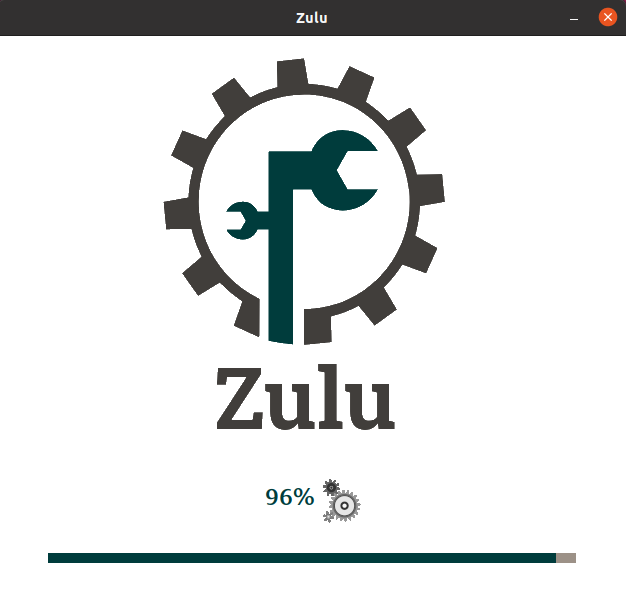
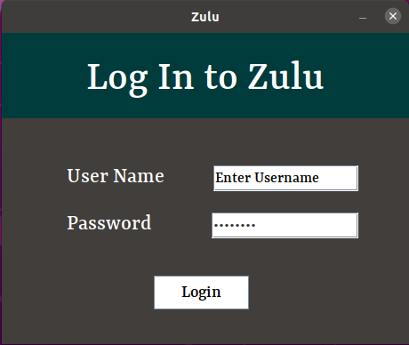
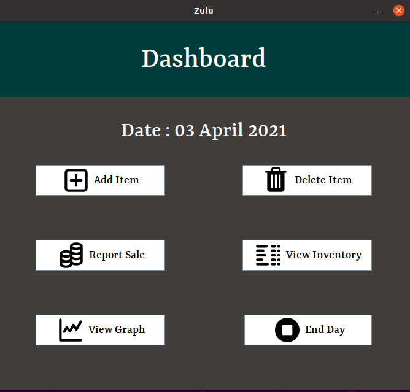
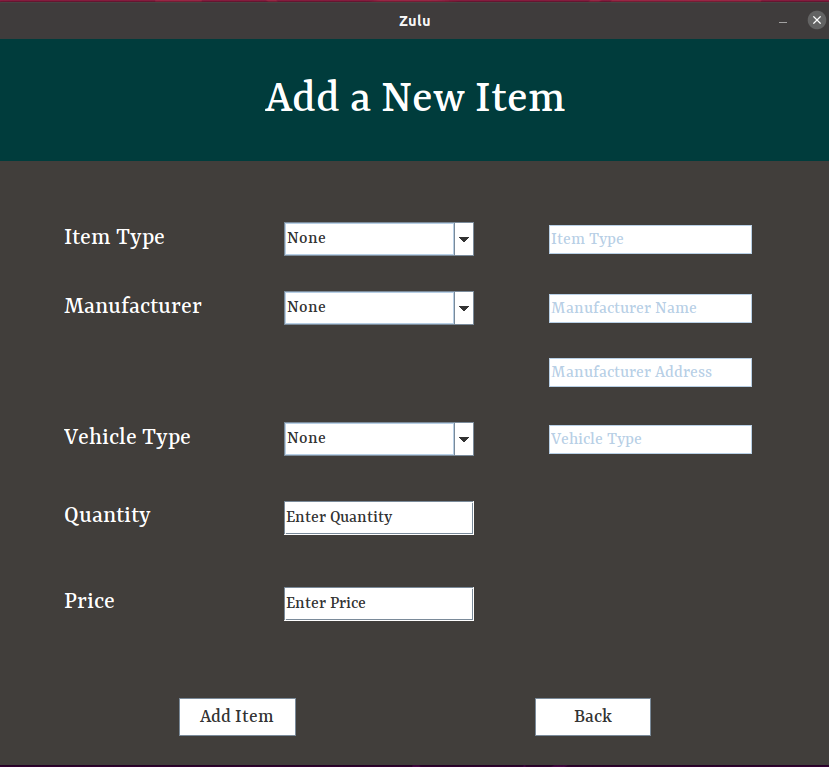
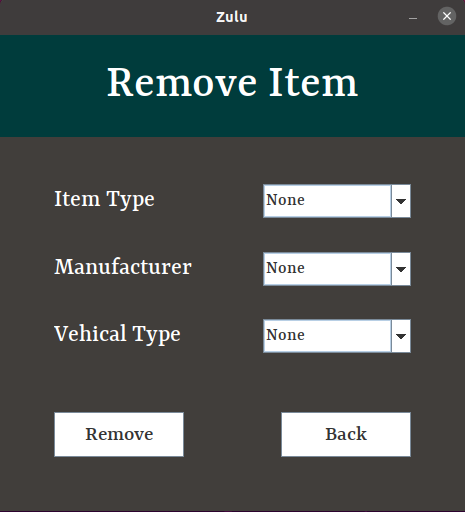
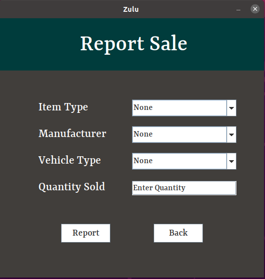
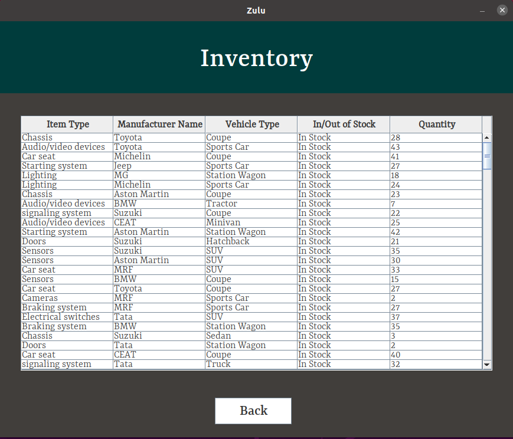
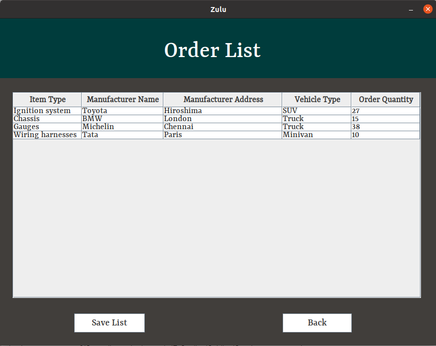
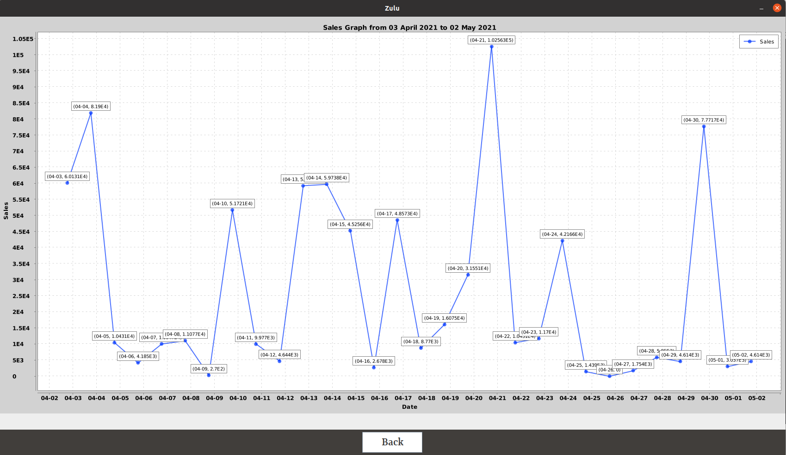

# Zulu - A Motor Part Shop Software

This project was undertaken by [Ashutosh Kumar Singh](https://github.com/ashutoshaks), [Vanshita Garg](https://github.com/vanshitagarg01) and [Suhas Jain](https://github.com/suhas142) for the course Software Engineering Laboratory (CS29006).

## Objective

Zulu is a software that manages the inventory and streamlines the sales and supply ordering for an automobile spare parts shop. This can be used by a motor parts shop owner. The software contains features to keep track of the quantity of each part in the inventory, order items when
required and generate sales reports on a daily and monthly basis.

## Setup and Build Instructions

- First, open MySql in the terminal and set up a user : 
    ```
    > CREATE USER 'VASachcha'@'localhost' IDENTIFIED WITH mysql_native_password BY 'OKZulu!';
    > GRANT ALL PRIVILEGES ON *.* TO 'VASachcha'@'localhost';
    ``` 
- Now, login as this user :
    ```
    $ mysql -u VASachcha -p
    ```
    When prompted for the password, enter "OKZulu!".

- Run the `setup.sql` file in MySql to setup the database for the project. You can also optionally choose to run the `masterdata.sql` file to begin with some data :
    ```
    > source <path to setup.sql>
    > source <path to masterdata.sql>
    ```
- Now, build the project in Apache Netbeans and run it.

- If you do not have Apache Netbeans, then navigate to the `dist` folder of the project directory, and there in the terminal, enter : 
    ```
    java -jar Zulu.jar
    ```
    This will also execute the project.

## Features

- The software connects to the database for retrieving and storing data.

    <!--  -->
    

- Login for the shop owner.

    

- The shop owner is the main operator of the software and has absolute access to all the functionalities as indicated in the dashboard.

    

- The Add Item feature allows the owner to add a new item to the shop inventory by specifying its type, manufacturer details, vehicle type, initial quantity and price.

    

- The Delete / Remove Item feature allows the owner to remove an item from the inventory, which is no longer needed.

    

- The Report Sale feature allows the owner to record a transaction for a particular motor part.

    

- The View Inventory feature allows the owner to get a glance at a list of all the items currently present in the inventory.

    

- After the end of a day, the software generates a list of items to be ordered, which have fallen below a particular threshold, following the just-in-time philosophy.

    

- The owner can also view the total sales of a day at the end of that day.

    

- The software also generates a graph at the end of each month showing the daily sales for that month.

    